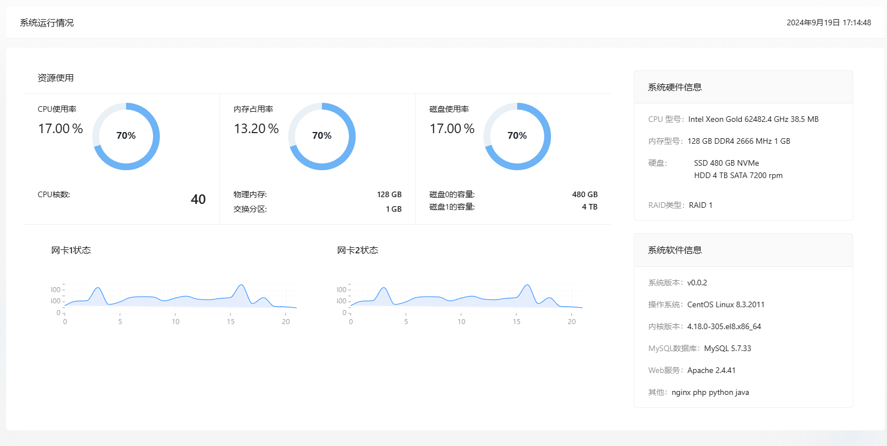

# WEB前端项目模板

## 技术栈
开发  
Ant Design Pro 6  
Typescript  
部署  
Docker  
Nginx  

## 实现功能
- [x] 用户登录(用户名、密码方式)  
- [x] 用户注册(用户名、密码方式)  
- [x] 个人信息修改  
- [x] 账户设置  
    - [x] 密码修改  
    - [ ] 邮箱认证  
    - [ ] 安全问题  
- [x] 系统状态  
- [ ] 系统管理  
    - [x] 用户管理(用户增删改查)   
    - [ ] 日志管理


## 环境配置

依赖安装

```bash
npm install
```

or

```bash
yarn install
```

## 提供的脚本

 `package.json` 提供很多可用脚本

### 启动项目

```bash
npm start
```

### 构建项目

```bash
npm run build
```

### 检查项目风格

```bash
npm run lint
```

修复 lint 错误

```bash
npm run lint:fix
```


## 部署

### Nginx 部署 (Linux 环境)
已经写好 bash 脚本按照下面的步骤执行即可
```bash
# 在 deploy 目录下执行命令
./deploy --package  # 项目打包, 打包后的文件路径 deploy/deploy-package.tar.gz

# 将生成的包文件上传到服务器中解压
tar xzf deploy-package.tar.gz

# 进入解压后的目录
cd deploy

# 执行部署脚本
./deploy --deploy
```

### Docker 部署
注意：dockerfile 中使用 node 18 需要高版本的 glibc
```bash
docker build --target builder -t frontend-template-build:0.0.1 .
docker build -t frontend-template:0.0.1 .
docker run -itd -p 8080:80 -e BACKEND_URL=后端接口地址 frontend-template:0.0.1 
```

## 效果
系统信息

登录页面  
  
注册页面  
  
用户管理页面  
  
用户个人信息  
  
